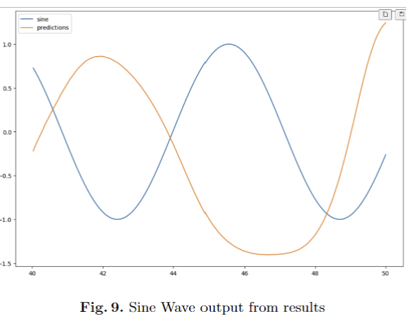
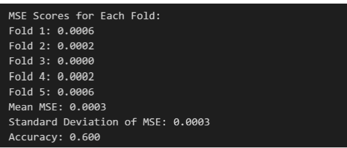
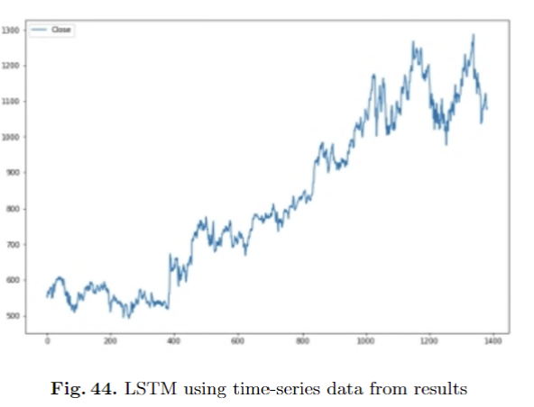
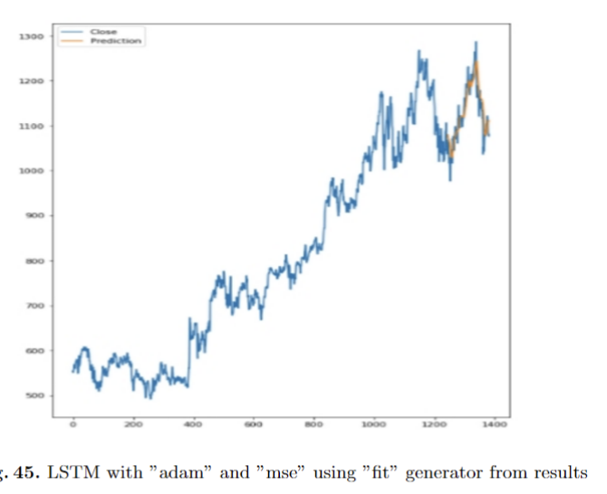
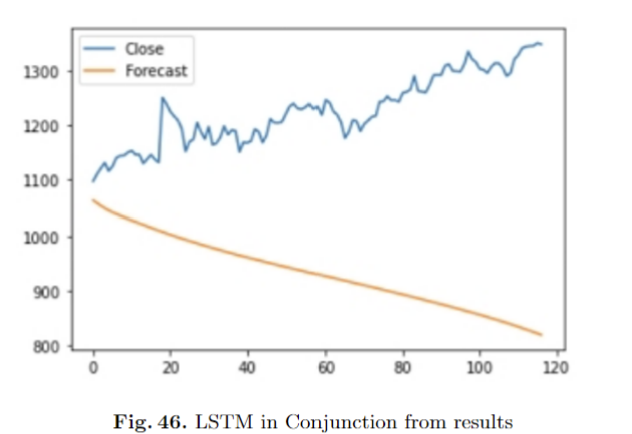
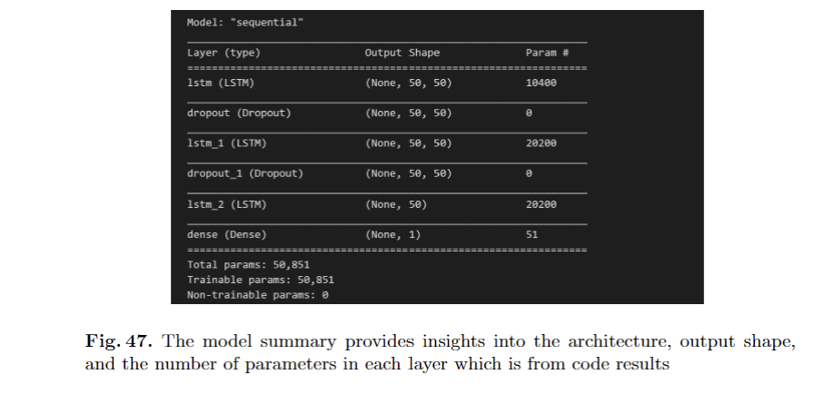

# Project-capstone-gorentla  
# Household energy consumption - time series data  
# Introduction:  
Related to this project the dataset which describe about “House Hold Energy” which is a time-series data.
The data was related to San Jose unit over the course of a year and a half. The energy business collects and shares the data acquired by smart meters. Because this is time-series data, it may be utilized for a variety of time-series Machine Learning studies. Different electrical quantities and some sub-metering values are available.  

Description of Data:  
There are 70368 rows and 8 columns in the dataset and the data contains electricity usage 10/22/2016 to 10/24/2018. 

The dataset contains the following eight attributes: 
TYPE - This is an information column. The value is 'Electric usage' for all the given observations. 
DATE - Date of electric consumption. 
START TIME - Start time of the consumption. 
END TIME - End time of the consumption. 
USAGE - Consumption in kWh. 
UNITS - This column denotes measurement unit. The power consumption available in the dataset is only in kWh. 
COST - Cost of consumption in $. 
NOTES - Mostly an empty column 

Kaggle dataset: https://www.kaggle.com/datasets/jaganadhg/house-hold-energy-data  

Author : Priyanka Gorentla 
Modified Date : 29th November 2023  

# Prerequisites  
Python 3.10 or higher  
VS Code  
VS Code Extension: Python  
Git (configured)  
# Verify Installations / Update Default Python  
In VS Code, open a terminal window (View / Terminal). If macOS/Linux, change python to python3 in the commands below.  
git --version  
python --version  
python -m pip install --upgrade pip wheel  
# Abstract  
This project centers around the exploration of time series machine learning models for the prediction of household energy consumption in the San Jose area, California. The data for this project covers a period of thirty months which comes from meters. Data includes readings related to sub metering as various electrical characteristics such as current, voltage and power factor. Initially, a detail examination of the data will be carried out in order to understand its characteristics and identify any trends and out-liners. Once the data is ready and prepared different time series machine learning modules will be evaluated. The accuracy of these models prediction of energy usage will be used to evaluate their efficiency. After from its goals, it has social benefits like helping a household reduce their energy consumption. It can also improve grid dependability and efficiency by monitoring and helping energy suppliers in supply and demand dynamics.  

OverLeaf Report : https://www.overleaf.com/read/zcbzzwsqkhjw#d4e32d  

# Key steps in project implementation  
Steps include 1.Data gathering and preparation. 2. Data Examination. 3. Cre-ation of Model. 4. Examination of Model. 5. Deployment of a Mode  

# Goals  
Intention to analyze data problem revolves around reducing energy usage in households. This problem holds immense significance as it contributes to global energy usage and greenhouse gas emissions  

# Here's an overview of the first_step code and its functionality:  

# Library Imports:  
Basic Python libraries such as pandas, numpy, and matplotlib are imported. TensorFlow's Keras components, including Sequential, Dense, and SimpleRNN, are imported.  

# Data Preparation:  
A simple sine wave is generated using numpy. The sine wave data is loaded into a pandas DataFrame for further analysis. The dataset is split into training and testing sets.  

# Normalization of Data:  
The MinMaxScaler from scikit-learn is used to normalize both the training and testing datasets.  

# Time Series Generator: 
A TimeSeriesGenerator instance is created to generate batches of temporal data for training the RNN model. 

# Model Architecture: 
A Simple RNN model is built using Keras. It consists of one SimpleRNN layer with 64 neurons and a Dense layer for output. The model is compiled using the Adam optimizer and Mean Squared Error (MSE) loss function.  

# Model Training: 
The model is trained using the fit_generator method with the training TimeSeriesGenerator for a specified number of epochs. 

# Model Evaluation: 
The model's performance is evaluated using the loss values during training, visualized using matplotlib. 

# Testing and Predictions: 
1.The trained model is used to predict energy consumption on the test data. 
2.Predictions are converted back to the original scale using the inverse transformation. 
3.The predicted values are added to the test dataset. 

# Visualization: 
The true values and predicted values are visualized using matplotlib to compare the original sine wave with the predicted values. 

# Exploratory Data Analysis and Machine Learning Model Implementation Code Explanation i.e EDA.ipynb  

# Loading Data:  
The dataset is loaded from a CSV file using Pandas. Basic libraries like NumPy and Matplotlib are imported for data analysis and visualization.  

# Preprocessing:  
The dataset is initially explored using functions like head(), dtypes, and describe() to understand its structure and characteristics.The class distribution of the 'TYPE' column is examined to gain insights into the dataset.  

# Data Cleaning: 
The 'DATE' column is converted to datetime objects, and unnecessary columns are dropped.Missing values in the 'NOTES' column are replaced with empty strings. 

# Data Visualization: 
Histograms are created to visualize the distribution of the 'USAGE' variable.Pair plots and violin plots are generated to explore relationships between variables and visualize the spread of 'USAGE.' 

# Linear Regression Model: 
A Linear Regression model is implemented using scikit-learn. The 'DATE' column is converted to the number of days since the minimum date to facilitate model training. The dataset is split into training and testing sets. 

# Model Training: 
The Linear Regression model is trained on the training set.Predictions are made on the testing set, and metrics like Mean Squared Error (MSE) and R-squared (R2) are calculated. 

# Cross-Validation:  
K-fold cross-validation is performed to assess the model's performance.Mean Squared Error (MSE) scores for each fold are calculated and printed.The mean and standard deviation of MSE scores are provided.  

# Classification Metrics:  
An example of classification metrics is demonstrated using accuracy scores.  

# Prediction on New Data:  
The trained model is used to predict 'USAGE' values for new data.  

# Time Series Forecasting Using LSTM Neural Networks i.e third_Step.ipynb  

# Loading Data:  
The historical stock data is loaded from a CSV file using Pandas. The dataset is initially explored using functions like head(), dtypes, and describe() to understand its structure and characteristics.  

# Filtering Attributes:  
Only the 'Close' attribute is selected for analysis, as the research focuses solely on closing prices.  

# Data Preprocessing:  
The data is normalized using MinMaxScaler to ensure consistency and improved model performance.
The dataset is split into training and testing sets for model evaluation.
A TimeSeriesGenerator is created for training the LSTM model.  

# LSTM Model:  
1. A Sequential model is built using TensorFlow's Keras library, incorporating three LSTM layers with dropout for regularization.  
2. The model is compiled using the Adam optimizer and Mean Squared Error (MSE) loss function.  

# Training the Model:  
The LSTM model is trained using the fit_generator method with the training TimeSeriesGenerator.
Model performance is visualized by plotting the training loss over epochs.  

# Model Evaluation:  
The model is evaluated on the testing set, and the performance is visualized. 

# Time Series Forecasting:  
A separate TimeSeriesGenerator is created for forecasting future data points.The model is used to predict future closing prices for the testing period.  

# Visualization: 
1. Predicted closing prices are visualized alongside the actual closing prices for both the training and testing periods.  
2 A comparison is made between the forecasted values and the actual closing prices from a subsequent dataset (July 2019 - December 2019).  

# Results  

1. A two-layer long short-term memory (LSTM) architecture was used to train
the first RNN model with 10% of the data set. Each LSTM layer includes
50 regular neurons and a 20% dropout layer. The time series input order
of 1382 elements, training and test batch sizes were 32 and 1. One hundred
training sessions were used to build the model Recall that the predicted
values decreased as the values close to the actual increased throughout the
experiment. 
2. Subsequently, some key features of the model were modified. The propor-
tion of test data provided increased to 30%, indicating strong monitoring.
Reduced the training sets to 30 and the epochs to 80. Note that the LSTM
set consists of two layers each of 50 neurons and a 20% dropout layer. The
default time series input sequence size was 1382. Kera’s sequential API was
used to run the models to improve approximate value predictions.  
3. According to testing, the original model predicted a price range of $950 to
$1100 to $1200, settling somewhere in that range and today’s model, which
has been revised in resolutions, expands this range in larger, causing it to
approach 1000. In both cases, the end-of-day reading was higher than ex-
pected Testing was also included, the complex behavior of the LSTM model
was better understood and the model parameters were modified . 

# Conclusion  

As a result of working on this project, I was able to acquire a wide range of new abilities, and I consider the outcome to be satisfying because the actual outcomes were very close to the projected outcomes and did not deviate by more than a reasonable margin. Nevertheless, RNNs have trouble retaining information in the short term, making them a poor choice for handling sequential input. RNNs' ability to regulate data flow through their gating mechanism is a key component in fixing the problem. If you are interested in observing the impact of modifying the values of the hyper-parameters or assembling the model with alternative sets of optimizers like Adam, SDG, and others, you should perform the following. Honestly, you can't go wrong with either option. The project used the Keras API to build the model and gave an introduction to RNN and LSTM techniques. With this new understanding, I feel confident using the LSTM algorithm.  

